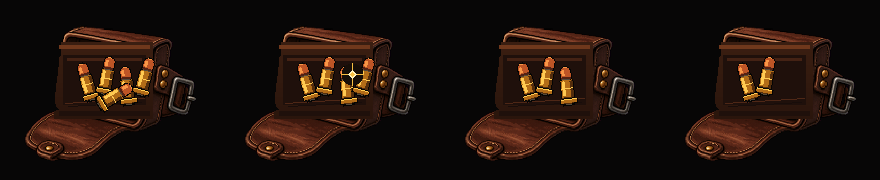
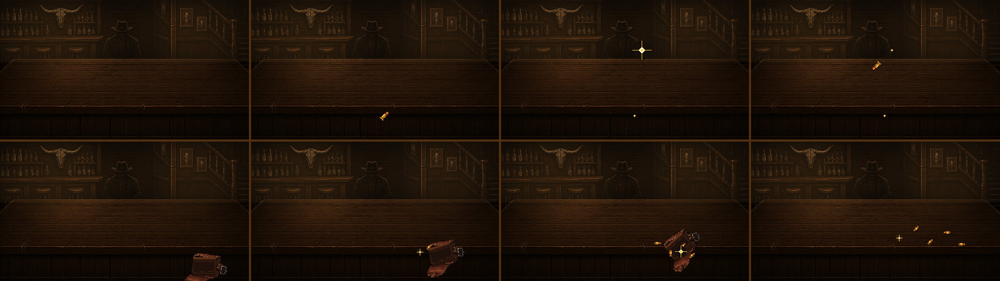

# 상점 총알 결제·주머니 수량 UI 0.3.8

연결 이슈: [#36](https://github.com/rupria/codex_game/issues/36)

## 핵심 구조

주머니 원본에 총알을 고정으로 포함하지 않습니다.

- 빈 주머니: `bar_shop_ammo_pouch_empty_180x150_0_3_8.png`
- 개별 총알: `bar_shop_ammo_pouch_bullet_24x40_0_3_8.png`
- 5발 합성 폴백: `bar_shop_ammo_pouch_pile_5_180x150_0_3_8.png`
- 사용 중단: `bar_shop_ammo_pouch_hand_cover_220x180_0_3_8.png` — 런타임에 연결하지 않습니다.

표시 총알의 단일 데이터 원본은 현재 플레이 세션의 `BulletCount`입니다. 구매 시 기존 총알 자식을 정리하고 현재 값과 같은 개수로 즉시 다시 그립니다. 손 가림 연출은 제거했습니다.

## 개수 배치

- `0~5`: 큰 총알 `24×40`을 서로 다른 X/Y/회전값으로 겹쳐 작은 더미처럼 표시합니다.
- `6~30`: 작은 총알 `10×18`을 행마다 오프셋과 회전을 달리해 쌓습니다. 정사각 격자나 빈 슬롯 프레임을 사용하지 않습니다.
- 자식 개수는 항상 `BulletCount`와 일치해야 합니다.
- 구매 직후 `BulletCountAfter = BulletCountBefore - Price`이며 증가 방향으로 바뀌면 안 됩니다.

## 결제 연출 분기

### 가격 1~2발

- 화면 하단 밖에서 총알이 동전처럼 튕겨 올라옵니다.
- 총알은 8프레임 동안 회전합니다.
- 포물선 최고점 한 프레임에만 황동 표면 반짝임을 표시합니다.
- 런타임 시트: `bar_shop_bullet_coin_flip_glint_8f_512x64_0_3_8.png`

### 가격 3발 이상

- 주머니가 화면 하단에서 들어와 테이블 쪽으로 기울어집니다.
- 가격과 같은 수량의 총알이 테이블에 쏟아져 한두 번 짧게 튄 뒤 멈춥니다.
- 런타임 시트: `bar_shop_bullet_pour_table_8f_1280x120_0_3_8.png`
- 시트 샘플은 5발이지만 런타임 생성 수량은 실제 `Price`를 사용합니다.

## 타이밍

1. 구매 확정: 이전 수량 캡처, 입력 잠금
2. `Price <= 2`: 화면 하단에서 0.50초 총알 투척·회전 / `Price >= 3`: 0.75초 붓기
3. 최고점 또는 테이블 충돌 프레임에만 짧은 반짝임
4. 결제 수량만큼의 투척·낙하가 끝난 뒤 `BulletCountAfter` 기준으로 주머니 더미 재구성
5. 차감된 수량 공개, 입력 잠금 해제

## QA

- [ ] 구매 전 표시 총알 수가 `BulletCountBefore`와 같다.
- [ ] 구매 중 손 이미지가 나타나지 않는다.
- [ ] 주머니 안 총알이 세로 슬롯이나 정사각 격자로 보이지 않고 작은 더미로 보인다.
- [ ] 구매 후 표시 총알 수가 `BulletCountAfter`와 같다.
- [ ] 구매로 총알 표시 개수가 증가하지 않는다.
- [ ] 가격 1~2는 튕김, 3 이상은 붓기 연출을 사용한다.
- [ ] 총알 차감과 인벤토리 반영은 한 번만 발생한다.
