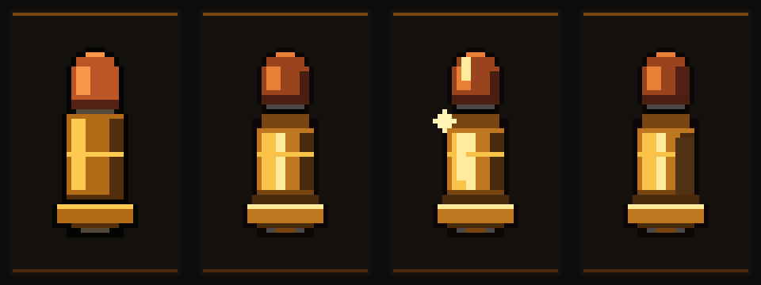
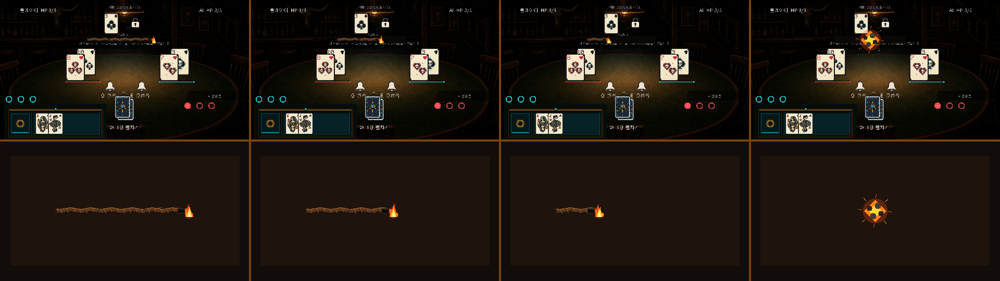

# 총알·할리갈리 도화선 아트 0.3.9

연결 이슈: [#24 밧줄 타이머](https://github.com/rupria/codex_game/issues/24), [#36 상점 총알 결제](https://github.com/rupria/codex_game/issues/36)

## 총알 비주얼 개선 이력

- `0.3.0`: 상점 탄약 패널의 단순한 노란 총알 픽토그램.
- `0.3.3`: `24×40` 구리 탄두·황동 탄피를 분리하고 `idle / shine / low` 상태를 추가.
- `0.3.8`: 고정 총알이 없는 빈 주머니, 개별 총알, 손 가림, 1~2발 플립 및 3발 이상 붓기 시트로 분리.
- `0.3.9`: 탄두의 둥근 실루엣, 탄두 고정 홈, 탄피 목, 4단계 금속 명암, 추출 림과 뇌관을 강화. 새 총알로 플립·붓기 시트도 재생성.

비교 시안은 왼쪽부터 `0.3.3 기존 / 0.3.9 idle / 0.3.9 shine / 0.3.9 low`입니다.

## 할리갈리 도화선 변경

기존 절차형 단색 막대와 사각 매듭 대신 살룬 조명에 맞는 짙은 기름먹인 도화선을 사용합니다.

- 밧줄 본체: 어두운 밤색 3가닥 꼬임, 불규칙 외곽, 느슨한 섬유, 그을음과 보수 감김.
- 연소 끝: 검게 탄 섬유와 붉은 잔불을 표현하는 별도 char cap.
- 불꽃: 6프레임, 좌우 흔들림·속불·불티·연기 포함.
- 시간 초과: 8프레임, 섬광→화염→검은 연기 전환.
- 밝은 황마색을 넓게 사용하지 않고, 살룬 조명이 닿는 윗면에만 탁한 황토색 하이라이트를 제한.

## 런타임

- 총알: `Assets/Art/Prototype/UI/BarShop_0_3_9/`
- 도화선: `Assets/Art/Prototype/UI/Halli_0_3_9/`
- 좌표·프레임 규격: `bullet_rope_art_catalog_0_3_9.json`

## Aseprite 원본

- `source/bar_shop_bullet_western_brass_states_0_3_9.aseprite`
- `source/bar_shop_bullet_coin_flip_glint_0_3_9.aseprite`
- `source/bar_shop_bullet_pour_table_0_3_9.aseprite`
- `source/halli_rope_braided_body_0_3_9.aseprite`
- `source/halli_rope_burn_char_cap_0_3_9.aseprite`
- `source/halli_rope_burn_flame_0_3_9.aseprite`
- `source/halli_rope_timeout_burst_0_3_9.aseprite`

재생성: `source/generate_bullet_rope_0_3_9.ps1`
