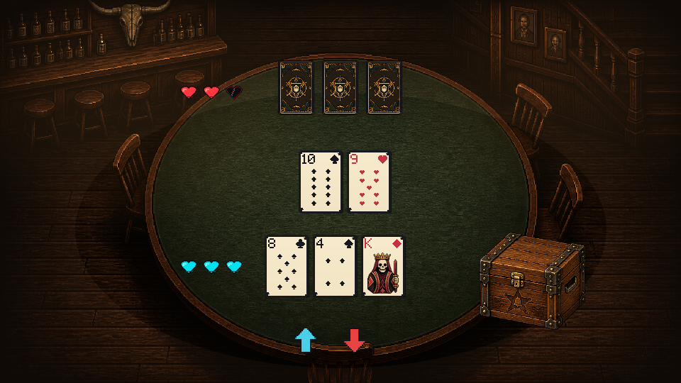
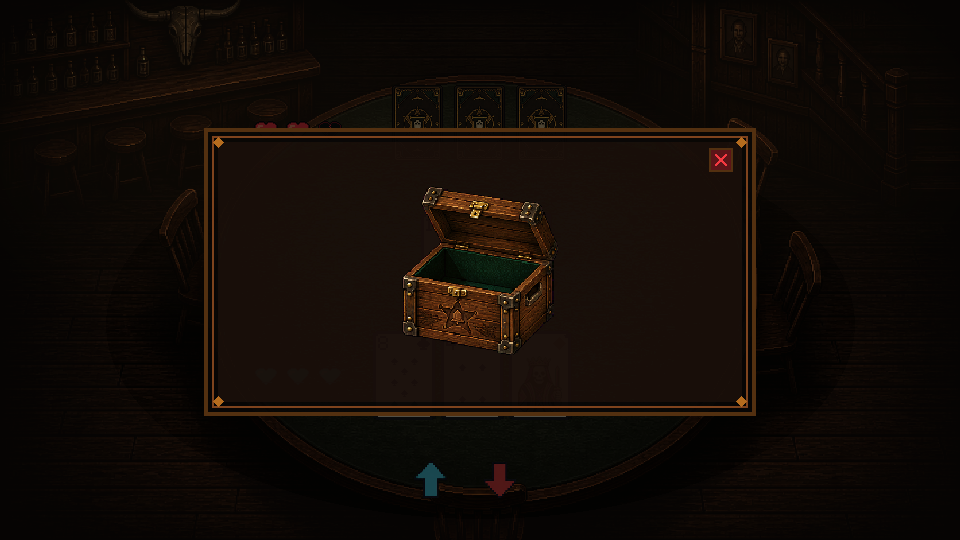
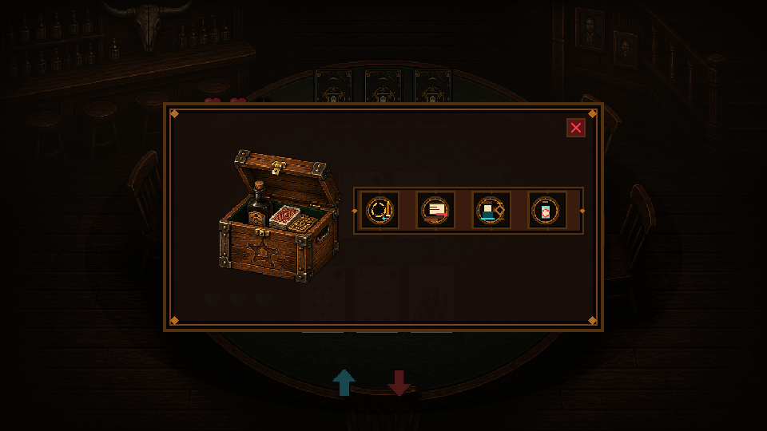

# 프로그래머 확인용 — 게임진행플로우 0.1.2 아트

아트 연결 이슈: [#37](https://github.com/rupria/codex_game/issues/37)

이번 리비전은 상점, 할리갈리, 포커 UI와 살룬 조명 기준을 연결 가능한 상태로 정리한 것입니다. 게임 규칙 로직은 변경하지 않았습니다.

## 상점

- 상품 슬롯 4개: X `20, 250, 480, 710`, Y `146`, 크기 `190×174`
- 총알 주머니: `(776,384)`, `180×150`, 별도 사각 프레임 없음
- 버튼 PNG에는 아이콘과 문자를 굽지 않고 TMP 텍스트를 올림
- 구매 시 총알 1발이 주머니에서 상점 주인 쪽으로 회전하며 날아가는 연출

## 할리갈리

- 좌우 필드마다 최근 카드 최대 3장 표시
- 최신 카드만 판정에 사용하고, 뒤 카드들은 계산 보조용 이력으로만 표시
- 플레이어 청록 레일, AI 붉은 레일

## 포커 아이템 상자

### 닫힘

### 열림 — 아이템 없음

### 열림 — 아이템 있음

- 포커 본 화면에서 총알 개수 및 총알 관련 미터를 표시하지 않음
- 닫힌 상자 클릭 시 불투명 팝업을 열고 뒤쪽 입력을 차단
- 보유 아이템 `0개`면 `open_empty`, `1개 이상`이면 `open_filled + 4칸 인벤토리`
- AI는 0.1.2 기준 아이템을 사용하지 않으므로 AI 아이템 상자를 표시하지 않음

런타임 경로:

- `Assets/Art/Prototype/UI/Poker_0_3_4/` — 닫힘/열림 빈/열림 채움 상자 원본
- `Assets/Art/Prototype/UI/Poker_0_3_6/` — 팝업 프레임 및 포커 연결 리비전
- `Assets/Art/Prototype/UI/Gameplay_0_1_2/` — 아이템 아이콘/인벤토리 공용 리소스

## 조명

- 테이블 키 라이트: 현재 값의 `×1.20`
- 살룬 전체를 읽을 수 있는 따뜻한 광역 보조광 추가
- 바 선반·병·액자·계단·의자·바닥 결이 보이는 수준을 목표로 함
- 조명 기구 자체는 카메라에 보이지 않아도 됨
- 자세한 값: [lighting_art_handoff_0_3_6.md](lighting_art_handoff_0_3_6.md)

## 연결 완료 체크

- [ ] 상점 상품 4개와 주머니가 겹치지 않는다.
- [ ] 할리갈리 최근 카드 3장이 보이고 최신 카드만 판정한다.
- [ ] 포커 본 화면에 총알 수가 없다.
- [ ] 포커 상자 클릭 시 빈/채움 팝업이 데이터에 따라 분기된다.
- [ ] 팝업이 열린 동안 뒤쪽 입력이 차단된다.
- [ ] 살룬 배경이 검은 실루엣이 아니라 공간으로 읽힌다.
- [ ] 960×540, 1280×720, 1920×1080에서 UI가 겹치지 않는다.
