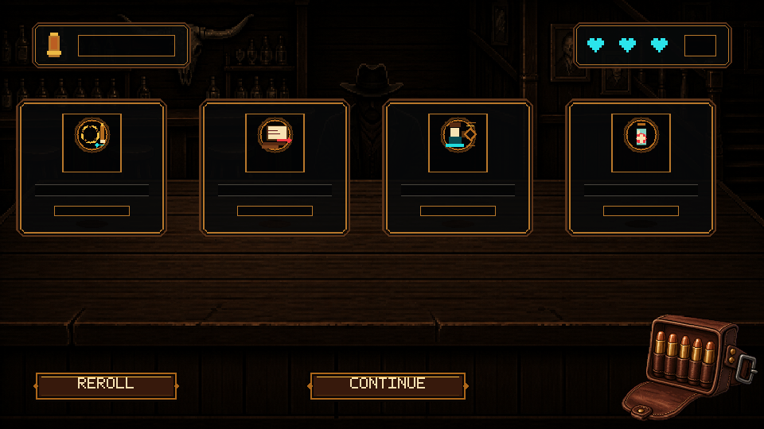
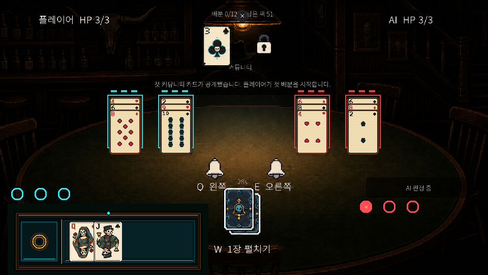
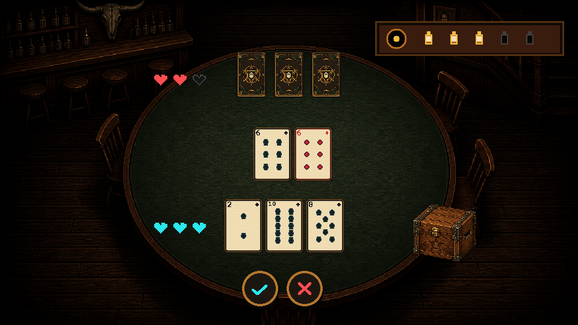
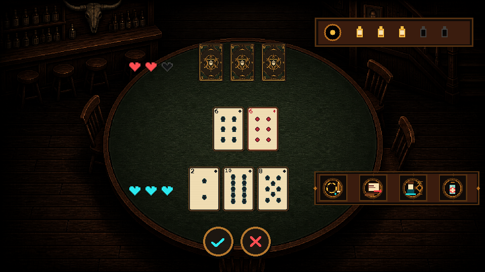
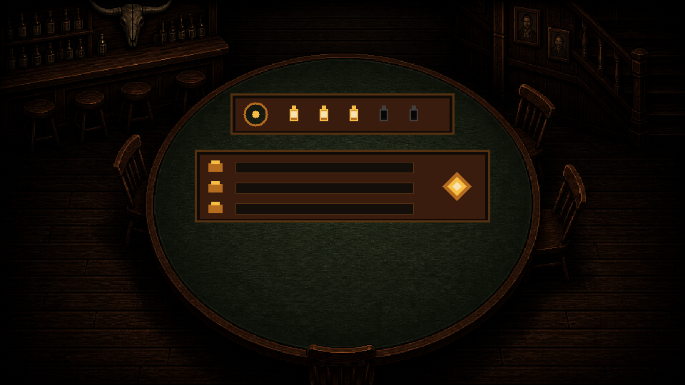

# 프로그래머 확인용 — 게임진행플로우 0.1.2 아트

이 문서부터 확인하면 됩니다. 아트 작업은 완료됐고 게임 규칙 코드는 변경하지 않았습니다.

- 연결 이슈: [#37](https://github.com/rupria/codex_game/issues/37)
- 상세 좌표·상태: [gameplay_art_programmer_handoff_0_1_2.md](gameplay_art_programmer_handoff_0_1_2.md)
- 기계 판독 카탈로그: [gameplay_art_catalog_0_1_2.json](gameplay_art_catalog_0_1_2.json)

## 1. 상점

- 상품 4칸을 상단으로 올림
- 우측 하단 탄약 주머니와 상품 비겹침
- 주머니 뒤 임시 사각 프레임 제거
- 구매 총알 투척 모션 유지

연결 대상:

- `Assets/Art/Prototype/UI/BarShop_0_3_4/`
- `Assets/Art/Prototype/UI/Gameplay_0_1_2/item_*.png`

## 2. 할리갈리

- 네 더미에 최근 카드 3장까지 표시
- 12px 세로 겹침으로 이전 카드의 좌상단 랭크와 우상단 문양 노출
- 최신 카드만 활성 판정, 이전 카드는 시각 이력

연결 대상:

- `Assets/Art/Prototype/UI/Halli_0_3_5/halli_reveal_history_rail_player_72x122_0_3_5.png`
- `Assets/Art/Prototype/UI/Halli_0_3_5/halli_reveal_history_rail_ai_72x122_0_3_5.png`

## 3. 포커

### 아이템 상자 접힘

### 인벤토리 열림

- AI는 아이템을 사용하지 않으므로 AI 아이템 슬롯 제거
- 플레이어 목재 상자 클릭 시 4칸 인벤토리 열림
- `IT-01 재장전`, `IT-02 밑장빼기`, `IT-03 바람잡이`, `HP-01 회복` 연결
- 여러 아이템을 순서대로 사용할 수 있게 매 사용 후 슬롯 상태 재평가

연결 대상:

- `Assets/Art/Prototype/UI/Gameplay_0_1_2/`
- `Assets/Art/Prototype/UI/Poker_0_3_5/`
- 기존 접힌 상자: `Assets/Art/Prototype/UI/Poker_0_3_4/poker_item_crate_closed_160x160_0_3_4.png`

## 4. 예측 성공과 보상

- 성공 누적은 현재 런 기준 0~5
- 실패·무반응은 기존 채움 수를 감소시키지 않음
- 결과 패널은 Unity TMP로 `기본 총알 / 예측 추가 / 최종 총알` 표시

## 5. 연결 완료 체크

- [ ] 상점 4개 상품과 탄약 주머니가 겹치지 않는다.
- [ ] 할리갈리 네 더미의 이전 카드 정보가 보이고 판정은 최신 카드만 사용한다.
- [ ] 포커 AI 아이템 슬롯이 없다.
- [ ] 플레이어 인벤토리가 0~4개와 4개 슬롯 상태를 표시한다.
- [ ] ItemId와 4종 아이콘이 일치한다.
- [ ] 예측 성공 0~5와 보상 수치가 내부 데이터와 일치한다.
- [ ] 960×540, 1280×720, 1920×1080에서 겹침을 확인한다.
