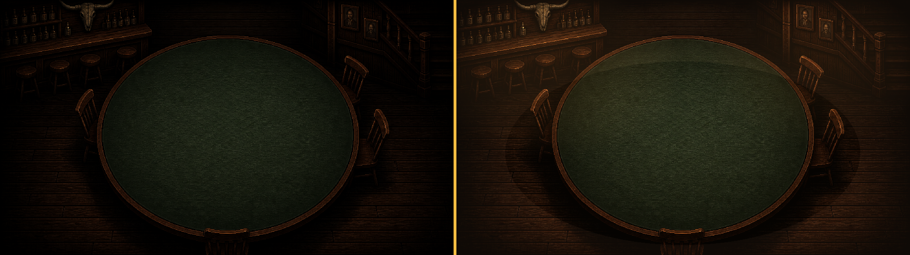

# 살룬 조명 아트 인계 0.3.6

## 확정 목표

테이블만 보이고 배경이 검게 사라지는 상태를 수정한다. 배경을 단순 실루엣으로 남기지 않고 바 선반, 병, 벽 액자, 계단, 의자, 바닥 나뭇결까지 읽히게 한다. 단, 테이블이 가장 밝은 초점이라는 위계는 유지한다.

기준 비교:

## Unity 권장 리그

1. 기존 테이블 Spot Light 강도 `×1.20`
2. 살룬 전체용 따뜻한 광역 보조광 `테이블 키의 35%`
3. 좌측 바 선반용 실내광 `18%`
4. 우측 벽·계단용 실내광 `15%`

정확한 Unity 기본 intensity 숫자는 현재 프레젠테이션 리그 값에 따라 달라지므로 절대값 대신 현재 키 라이트 대비 비율로 전달한다.

## 적용 주의

- 조명 오브젝트나 천장 조명 기구가 화면에 직접 보일 필요는 없다.
- 카드 및 Screen Space UI에는 이 월드 조명이 중복 적용되지 않게 한다.
- 배경 보조광은 게임 단계 전환 시 완전히 꺼지지 않고 최소 70% 이상 유지한다.
- 할리갈리/포커 줌 인에서도 바·벽의 공간 정보가 사라지지 않아야 한다.
- 결과 화면은 키 라이트를 낮추더라도 광역 보조광은 유지한다.

## QA 기준

- [ ] 가장 어두운 단계에서도 병과 의자 윤곽만이 아니라 재질과 면이 보인다.
- [ ] 테이블 카드 문양 및 숫자 대비가 기존보다 낮아지지 않는다.
- [ ] 살룬이 회색으로 뜨지 않고 따뜻한 갈색 계열을 유지한다.
- [ ] 화면 가장자리 비네트는 허용하지만 액자·계단 전체를 검게 잘라내지 않는다.
