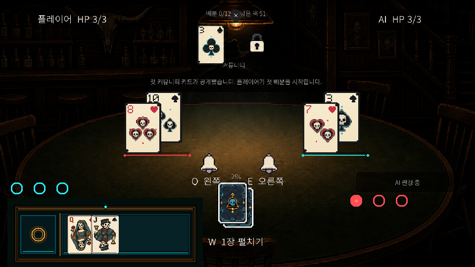
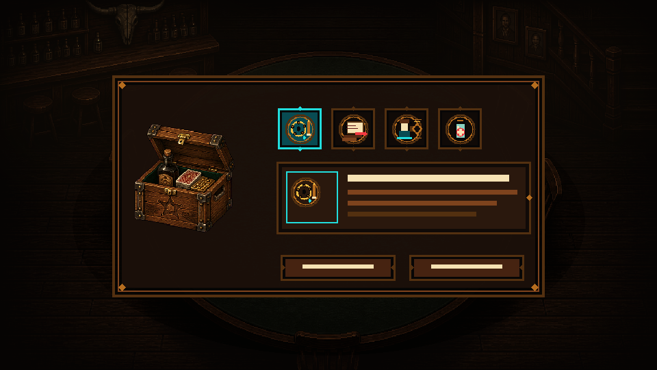
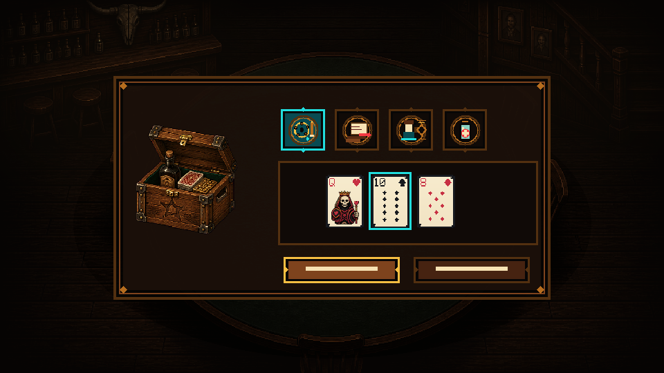

# 할리갈리 공유 더미·포커 아이템 선택 UI 0.3.7

연결 이슈: [#37](https://github.com/rupria/codex_game/issues/37)

이번 묶음은 규칙 로직을 구현하지 않고, 프로그래머가 현재 진행 중인 규칙 작업에 연결할 아트 상태만 제공합니다.

## 할리갈리 좌우 공유 더미

- 화면에는 독립 더미 4개가 아니라 좌·우 공유 더미 2개만 표시합니다.
- 왼쪽 더미 순서: 플레이어 1번째 카드 → AI 2번째 카드.
- 오른쪽 더미 순서: AI 1번째 카드 → 플레이어 2번째 카드.
- 두 번째 카드가 같은 위치에 들어오면 새 카드는 기준점에 남고, 이전 카드는 `(-42,+22)`만큼 아래·왼쪽으로 이동합니다.
- 이전 카드를 위 레이어에 그려 두 카드의 좌상단 랭크·문양과 중앙 해골 수가 함께 읽히게 합니다.
- 카드 뒤 검은 사각 패널은 사용하지 않습니다. 투명 레일만 사용합니다.
- 런타임 레일은 `idle`, `player_active`, `ai_active` 세 상태입니다.

런타임 경로:

- `Assets/Art/Prototype/UI/Halli_0_3_7/halli_shared_pile_rail_idle_140x136_0_3_7.png`
- `Assets/Art/Prototype/UI/Halli_0_3_7/halli_shared_pile_rail_player_active_140x136_0_3_7.png`
- `Assets/Art/Prototype/UI/Halli_0_3_7/halli_shared_pile_rail_ai_active_140x136_0_3_7.png`

## 포커 아이템 선택 단계

- 아이템 보유 시 상자를 열고 4칸 아이템 목록을 표시합니다.
- 선택 아이템은 청록 테두리로 강조하고, 아래 상세 패널에 아이콘·이름·효과 설명용 TMP 영역을 둡니다.
- 대상 카드가 필요한 아이템은 상세 패널을 카드 대상 선택 영역으로 교체합니다.
- `사용` 버튼은 유효한 대상이 선택될 때 활성화하고, `건너뛰기/패 확정` 버튼은 항상 접근 가능하게 합니다.
- 아이템이 없으면 기획 규칙대로 단계를 자동 건너뜁니다. 빈 상자 화면은 사용자가 상자를 눌렀을 때의 피드백 상태로만 사용합니다.
- 팝업이 열린 동안 뒤쪽 입력을 차단합니다.
- 버튼 PNG에는 문자를 굽지 않습니다. 실제 문구는 TMP로 올립니다.

런타임 경로:

- `Assets/Art/Prototype/UI/Poker_0_3_7/poker_item_select_panel_640x336_0_3_7.png`
- `Assets/Art/Prototype/UI/Poker_0_3_7/poker_item_detail_panel_376x112_0_3_7.png`
- `Assets/Art/Prototype/UI/Poker_0_3_7/poker_item_action_button_{idle|hover|disabled}_172x44_0_3_7.png`

## 적용 체크

- [ ] 좌·우 더미가 정확히 2개만 보인다.
- [ ] 각 더미는 최대 2장이고 두 카드의 랭크·문양·해골 수가 동시에 읽힌다.
- [ ] 카드 뒤에 불투명 검은 사각형이 없다.
- [ ] 최신 카드만 판정 대상으로 유지된다.
- [ ] 아이템 선택·상세·대상 선택 상태가 데이터에 따라 전환된다.
- [ ] 팝업이 열린 동안 뒤쪽 입력이 차단된다.
- [ ] 960×540, 1280×720, 1920×1080에서 카드·벨·팝업이 겹치지 않는다.

