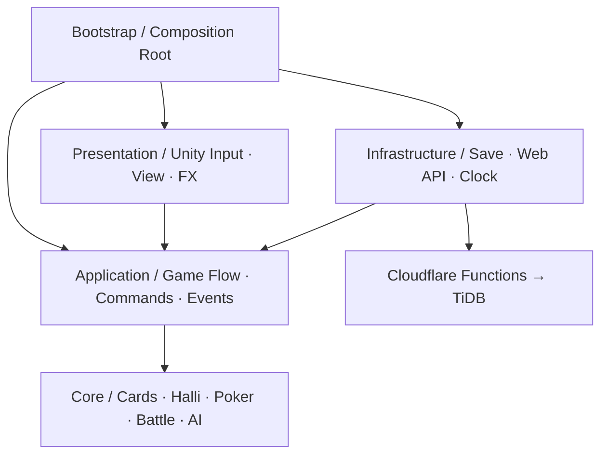
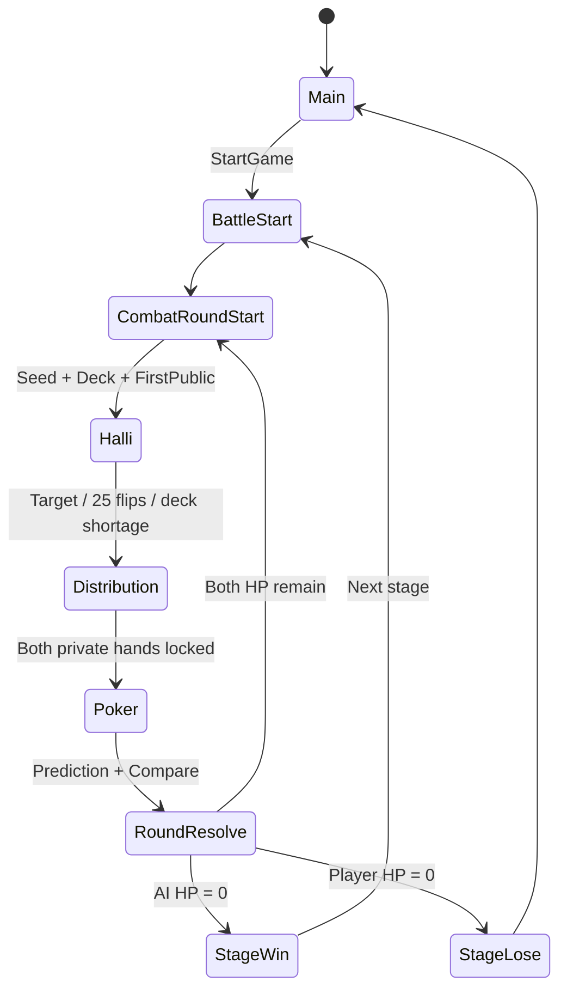
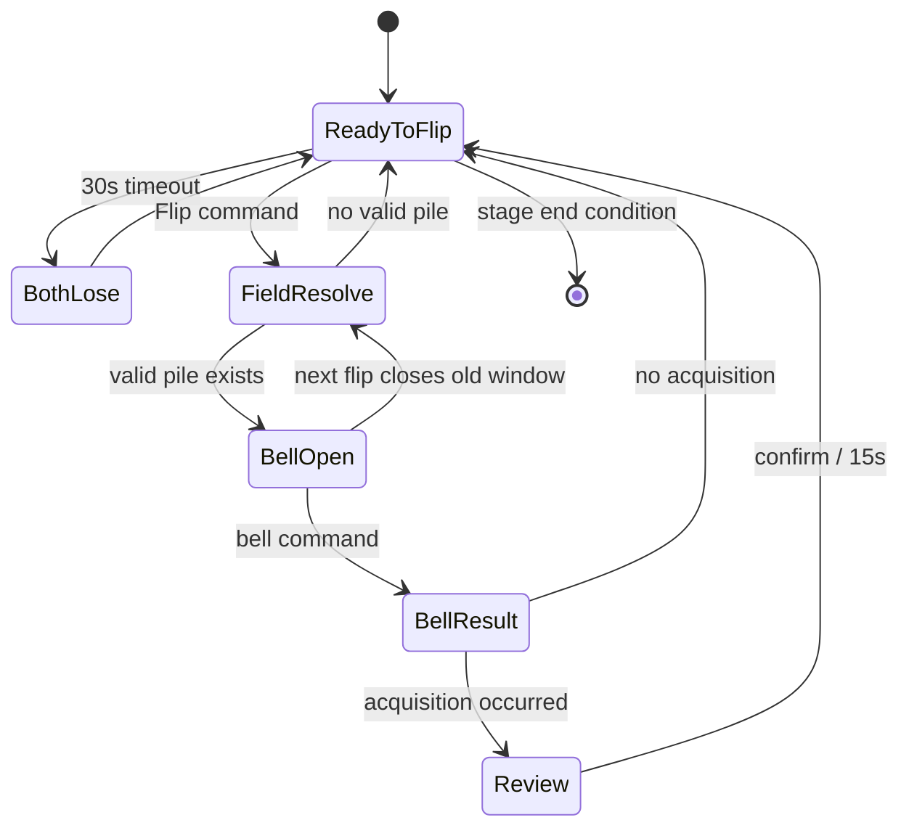

# 게임진행플로우 0.05 기능별 아키텍처 설계

- 작성일: 2026-08-06
- 담당 역할: 프로그래머
- 문서 상태: 구현 전 제안 기준
- 문서 기준 원본: `G:\내 드라이브\codex_game\obsidian\core\programer\26.08.06_게임진행플로우_0.05_기능별_아키텍처_설계.md`
- 기준 명세: `G:\내 드라이브\codex_game\obsidian\core\designer\게임진행플로우_0.05.md`
- 명세 SHA-256: `B05C044E148100BB46FBC4084503FAD0180E9159FF747277D2DC197D3B6C2994`
- 코드 작업공간: `C:\sk-encoa\codex_game`
- 기준 브랜치: `dev`
- 기준 커밋: `d2b9f41aa1b59940e260824212c8a87534156982`
- 온라인 코드 커밋: `1122b5a0c2095b288fc4e5573ee9e5eda9ca54ca`
- Git 공유 경로: `project_docs/programer/26.08.06_게임진행플로우_0.05_기능별_아키텍처_설계.md`

## 1. 목적

0.05 기능을 한꺼번에 결합하지 않고 기능별로 구현·테스트·커밋할 수 있는 구조를 정의한다.

핵심 목표:

- 카드 규칙과 승패 판정을 Unity 화면·물리·네트워크에서 분리
- 기능 하나를 수정해도 다른 기능의 카드 순서와 판정이 바뀌지 않음
- 동일한 전투 라운드 시드로 같은 덱과 카드 배분을 재현
- 아트가 없어도 순수 C# 테스트로 코어 플레이 검증
- TiDB와 Cloudflare 장애가 기본 플레이를 중단하지 않음
- 다른 PC에서도 같은 테스트 명령으로 결과 재현
- 기능별 단독 커밋과 동시 작업 범위 분리

## 2. 이번 설계의 범위

포함:

- 카드·덱·저장소
- 할리갈리 필드와 카드 획득
- 카드 펼치기·벨 시간 판정
- 할리갈리 단계 종료와 개인 카드 배분
- 포커 평가
- 1스테이지 AI
- 전투·HP·예측 보상·스테이지 전환
- Unity 입력·표현 어댑터
- 로컬 세이브·온라인 결과 기록
- 테스트와 조립 방식

제외:

- 아트 최종 표현
- FX·음원 최종 품질
- 아이템 상세 효과
- A 스트레이트 미확정 규칙
- 2스테이지 이후 AI 수치
- 공개 배포와 `pub` 통합
- 실제 TiDB 운영 스키마 변경

## 3. 설계 원칙

1. `Core`는 UnityEngine, 물리, 파일, 네트워크를 참조하지 않는다.
2. 모든 판정은 순수 C# 입력값을 받아 결과값을 반환한다.
3. Unity 입력은 명령으로 변환하고, Core 이벤트를 화면·FX로 표현한다.
4. 카드 순서에 사용하는 난수와 AI 행동 난수를 분리한다.
5. 시간 판정은 프레임 수가 아니라 단조 증가 타임스탬프를 사용한다.
6. 저장·분석은 완료된 판정을 기록할 뿐 판정 권한을 갖지 않는다.
7. 기능 간 직접 참조 대신 명확한 명령·결과·이벤트 계약을 사용한다.
8. 초기에는 DI 프레임워크 없이 Bootstrap에서 수동 조립한다.
9. 한 기능의 완료 조건에는 순수 C# 테스트가 반드시 포함된다.
10. 명세 미확정 항목을 코드에서 임의 확정하지 않고 정책 인터페이스 뒤에 둔다.

## 4. 계층과 의존성



허용 의존성:

| 모듈 | 참조 가능 |
|---|---|
| Core | .NET 표준 라이브러리만 |
| Application | Core |
| Presentation | Application, Core, Unity |
| Infrastructure | Application의 Port, Core DTO, Unity 네트워크 |
| Bootstrap | 모든 런타임 모듈 |
| Tests | 테스트 대상 모듈 |

금지:

- Core → Unity
- Core → TiDB·Cloudflare
- Presentation → TiDB 구현
- Infrastructure → Presentation
- 기능 A가 기능 B의 내부 컬렉션 직접 수정
- MonoBehaviour가 승패를 직접 결정

## 5. 어셈블리 전략

현재 `CodexGame.Core` asmdef와 .NET 링크 테스트 구조를 유지한다. 초기 단계에서 Core를 여러 asmdef로 과도하게 분할하지 않고 폴더와 namespace로 기능 경계를 만든다.

권장 어셈블리:

| 어셈블리 | Unity 참조 | 역할 |
|---|---:|---|
| `CodexGame.Core` | 없음 | 모든 결정적 게임 규칙 |
| `CodexGame.Application` | 없음 | 상태 머신, 명령, 이벤트, Port |
| `CodexGame.Presentation` | 있음 | 입력, UI, 카메라, FX, 오디오 |
| `CodexGame.Infrastructure` | 있음 | UnityWebRequest, 로컬 저장, 온라인 전송 |
| `CodexGame.Bootstrap` | 있음 | 실제 구현 조립 |

Core가 커져 컴파일 경계가 필요해질 때만 `Cards`, `Poker` 등을 별도 asmdef로 분리한다.

## 6. 권장 폴더 구조

```text
programer/CodexGame/Assets/Scripts/
├─ Core/
│  ├─ Shared/
│  │  ├─ Actor.cs
│  │  ├─ PileSide.cs
│  │  └─ RuleResult.cs
│  ├─ Cards/
│  │  ├─ Card.cs
│  │  ├─ CardId.cs
│  │  ├─ Deck.cs
│  │  ├─ CardZone.cs
│  │  ├─ CardLedger.cs
│  │  └─ DeterministicRandom.cs
│  ├─ Halli/
│  │  ├─ HalliField.cs
│  │  ├─ PileState.cs
│  │  ├─ FlipResolver.cs
│  │  ├─ BellResolver.cs
│  │  ├─ AcquisitionResolver.cs
│  │  ├─ HalliStageRules.cs
│  │  └─ DistributionResolver.cs
│  ├─ Poker/
│  │  ├─ PokerHand.cs
│  │  ├─ PokerEvaluator.cs
│  │  └─ PokerRuleSet.cs
│  ├─ Ai/
│  │  ├─ AiBellPolicy.cs
│  │  ├─ AiCardPolicy.cs
│  │  └─ AiDecision.cs
│  ├─ Battle/
│  │  ├─ BattleState.cs
│  │  ├─ CombatRoundState.cs
│  │  ├─ DamageResolver.cs
│  │  └─ StageTransitionResolver.cs
│  └─ Rewards/
│     ├─ PredictionResolver.cs
│     └─ RewardAccumulator.cs
├─ Application/
│  ├─ Commands/
│  ├─ Events/
│  ├─ StateMachine/
│  ├─ Ports/
│  └─ Snapshots/
├─ Presentation/
│  ├─ Input/
│  ├─ Views/
│  ├─ Animation/
│  └─ Audio/
├─ Infrastructure/
│  ├─ Persistence/
│  ├─ Online/
│  └─ Time/
└─ Bootstrap/
   └─ GameInstaller.cs
```

기능 파일 이름은 구현 과정에서 조정할 수 있지만 계층 방향은 유지한다.

## 7. 기능 모듈

| 번호 | 기능 | 책임 | 선행 기능 |
|---:|---|---|---|
| F01 | 카드 모델·덱·난수 | 52장 생성, 시드 셔플, 카드 보존 | 없음 |
| F02 | 카드 더미·저장소 | 좌우 최대 2장, 미획득 풀, 카드 이동 | F01 |
| F03 | 해골 획득 판정 | 1+2, 단독 3, 1+3·2+3 | F02 |
| F04 | 벨·시간 판정 | 33.3ms 동시, 오답, 양측 패배 | F02, F03 |
| F05 | 할리갈리 단계 | 30초, 25회, 승수 3→2→1 | F01~F04 |
| F06 | 개인 카드 배분 | 선택 3→2→1, 보충, 교대 배분 | F05 |
| F07 | 포커 평가 | 족보, 랭크, 문양 | F01 |
| F08 | 1스테이지 AI | 1.5초, 30%, 60/40 | F04, F07 |
| F09 | 전투·스테이지 | HP, 라운드, 예측, 코인 누적 | F05~F08 |
| F10 | Application 상태 머신 | 명령과 이벤트로 전체 흐름 조립 | F01~F09 |
| F11 | Unity 입력·표현 | 키·마우스, 화면·FX·카메라 | F10 |
| F12 | 세이브·온라인 기록 | 로컬 저장, outbox, TiDB 요약 | F10 |

## 8. 상태 모델

상태를 하나의 거대한 MonoBehaviour에 두지 않고 계층별 데이터로 나눈다.

```text
GameSessionState
├─ currentStageNumber
├─ accumulatedCoinBonus
├─ pendingRewardTokens
└─ BattleState
   ├─ playerHp
   ├─ aiHp
   ├─ combatRoundNumber
   └─ CombatRoundState
      ├─ roundSeed
      ├─ randomStepCounters
      ├─ deck/card ledger
      ├─ firstPublicCard
      ├─ HalliStageState
      └─ PokerRoundState
```

핵심 원칙:

- `GameSessionState`: 다음 스테이지까지 유지되는 값
- `BattleState`: 현재 스테이지 전투에서 유지되는 HP
- `CombatRoundState`: 새 시드와 덱이 적용되는 단위
- `HalliStageState`: 더미, 승수, 펼치기 횟수, 획득 풀
- `PokerRoundState`: 개인 카드, 공용 카드, 예측과 비교 결과

## 9. 상태 전환 구조



Halli 내부:



## 10. 명령과 이벤트 계약

### 명령

| 명령 | 주요 값 |
|---|---|
| `StartGame` | 시작 설정 |
| `FlipCards` | 입력 시각 |
| `RingBell` | actor, pile, 입력 시각 |
| `ConfirmReview` | 입력 시각 |
| `TogglePrivateCard` | card id |
| `ConfirmPrivateSelection` | 선택 카드 |
| `SkipItem` | 없음 |
| `ConfirmPrediction` | win/lose |
| `Advance` | 상태별 확인 |

### 도메인 이벤트

| 이벤트 | 소비자 |
|---|---|
| `CombatRoundStarted` | Presentation, Save |
| `CardsFlipped` | Presentation |
| `BellWindowOpened` | AI Scheduler, Presentation |
| `BellWindowClosed` | AI Scheduler |
| `HalliRoundResolved` | Presentation, Analytics |
| `HalliStageEnded` | Distribution |
| `PrivateCardsLocked` | Poker |
| `PokerResolved` | Battle, Presentation |
| `StageEnded` | Save, Online Result |

Presentation은 이벤트를 받아 연출하지만 이벤트 결과를 수정하지 않는다.

## 11. 카드 보존 모델

`CardLedger`가 모든 카드의 현재 위치를 추적한다.

카드 영역:

- Deck
- FirstPublic
- LeftPile
- RightPile
- UnacquiredPool
- PlayerAcquired
- AiAcquired
- PlayerPrivate
- AiPrivate
- SecondPublic
- Discarded 또는 Reserved

항상 만족해야 하는 불변식:

1. 한 전투 라운드에는 정확히 52개의 고유 CardId가 존재한다.
2. 한 카드는 동시에 두 영역에 존재하지 않는다.
3. 개인 카드와 공용 카드로 확정된 카드는 후보군에 남지 않는다.
4. 좌우 더미 노출 카드는 각각 2장 이하이다.
5. 펼치기 1회는 카드 2장을 함께 소비한다.
6. 남은 카드가 2장 미만이면 한쪽만 펼치지 않는다.
7. 같은 시드와 같은 명령 순서는 같은 카드 이동 결과를 만든다.

## 12. 시간 판정

기존 `double seconds` 비교는 33.3ms 경계에서 오차와 플랫폼 차이를 만들 수 있으므로 Core에서는 정수 마이크로초를 사용한다.

권장 타입:

```csharp
public readonly record struct GameTimestamp(long Microseconds);
public readonly record struct DurationUs(long Value);
```

상수:

- 동시 벨: `33_300us` 이하
- AI 최대 반응: `1_500_000us`
- 카드 펼치기: `30_000_000us`
- 리뷰: `15_000_000us`
- 개인 카드 선택: `60_000_000us`

Unity 어댑터가 단조 증가 시각을 제공하고 Core에는 타임스탬프 값만 전달한다. Core에서 `Time.time`을 호출하지 않는다.

## 13. 난수와 재현성

`IRandomSource`를 Core에 정의하고 결정적 구현을 사용한다.

권장 난수 채널:

| 채널 | 사용처 |
|---|---|
| CardOrder | 덱 셔플 |
| CardDistribution | 승자 보충, 패자 배분, 두 번째 공용 카드 |
| AiReaction | AI 놓침, 반응 지연 |
| AiChoice | 60% 최선, 40% 무작위 |
| Reward | 예측 성공 보상 종류 |

각 채널은 전투 라운드 시드와 채널 이름으로 파생한다. AI 코드 변경이 카드 덱 순서를 바꾸지 않게 하기 위한 분리다.

기록할 재현 정보:

- SpecRevision
- ContentVersion
- CombatRoundSeed
- 각 난수 채널 버전
- 필요 시 채널별 소비 횟수

## 14. AI 구조

AI는 상태를 직접 수정하지 않고 Application에 사람과 같은 명령을 제출한다.

```text
BellWindowOpened
→ AiBellPolicy
   ├─ 30% Miss
   └─ React: 0 ~ 1.5s 예약
→ 다음 Flip이면 예약 취소
→ 시간이 되면 RingBell(Ai, pile, timestamp)
```

카드 선택:

1. 유효 선택지 생성
2. PokerEvaluator로 점수 계산
3. 60%: 최고 점수
4. 40%: 유효 선택지 중 무작위
5. 유효 선택지가 하나면 그 선택지

AI도 Core 규칙을 우회해 카드를 직접 이동하지 않는다.

## 15. 포커 구조

`PokerEvaluator` 입력:

- 개인 카드 3장
- 공용 카드 2장
- `PokerRuleSet`

비교 순서:

1. 족보
2. 족보별 랭크 비교
3. 문양 `♠ > ♦ > ♥ > ♣`

A 스트레이트 범위는 미확정이므로 `PokerRuleSet`의 정책 값으로 분리한다. 값 확정 전 해당 경계 테스트를 보류 표시하고 임의 규칙을 확정하지 않는다.

## 16. 저장과 TiDB 경계

Application에 Port를 둔다.

```csharp
public interface IGameSaveRepository
{
  Task SaveAsync(GameSaveSnapshot snapshot);
  Task<GameSaveSnapshot?> LoadAsync();
}

public interface IMatchResultSink
{
  Task EnqueueAsync(MatchResultSnapshot result);
}
```

Infrastructure 구현:

- `LocalGameSaveRepository`
- `AnonymousGameApi`
- `QueuedMatchResultSink`

원칙:

- 저장 실패가 상태 전환을 롤백하지 않는다.
- 경기 결과는 로컬 outbox에 먼저 넣고 성공 후 제거한다.
- TiDB DTO와 Core 상태 객체를 동일 타입으로 사용하지 않는다.
- 비밀 키는 Unity와 Core에 전달하지 않는다.
- 초기에는 전투 또는 스테이지 경계 저장만 지원한다.
- 0.05 상세 분석 필드는 별도 `002` 마이그레이션으로 설계한다.

## 17. Bootstrap

`GameInstaller` 하나가 실제 구현을 조립한다.

조립 대상:

- RuleSet 0.05
- DeterministicRandomFactory
- MonotonicClockAdapter
- GameStateMachine
- Ai policies
- Input adapter
- View event dispatcher
- Local save repository
- Optional online result sink

온라인 기능이 없거나 실패하면 `NullMatchResultSink` 또는 로컬 큐로 대체한다. 코어 플레이는 동일하게 실행된다.

## 18. 기능별 구현 순서

### F01 카드·덱·난수

구현:

- CardId, Suit, Rank, SkullCount
- 52장 생성
- 결정적 셔플
- CardLedger 기초

완료 조건:

- 52장 중복 없음
- 같은 시드 동일 순서
- 다른 시드가 충분히 다른 순서
- 첫 공용 카드 제거 후 51장

### F02 더미·저장소

구현:

- 좌우 더미
- 최대 2장
- 세 번째 카드의 미획득 이동
- 선택 더미만 초기화

완료 조건:

- 카드 보존 불변식 통과
- 반대 더미 유지
- 펼치기 순서와 더미 초기화 독립

### F03 획득 판정

구현:

- 1+2, 2+1
- 단독 3
- 1+3·3+1·2+3·3+2
- 미획득 잔여 이동

완료 조건:

- 명세 표의 모든 조합 테스트
- 미정 `3+3`은 임의 결정하지 않고 별도 결과 반환

### F04 벨·시간

구현:

- 33.3ms 동시
- 플레이어 우선
- 오답·상대 획득
- 유효 더미 없음 양측 패배
- 다음 Flip의 이전 벨 종료

완료 조건:

- `33_299us`, `33_300us`, `33_301us` 경계 테스트
- 다음 Flip 후 이전 예약 AI 명령 무효
- 부동소수점 사용 없음

### F05 할리갈리 단계

구현:

- 30초 양측 패배
- 25회 한도
- 승리 목표 3→2→1
- 카드 2장 미만 종료
- 15초 리뷰

완료 조건:

- 각 종료 이유 테스트
- 양측 패배에서 더미 유지
- 한쪽만 카드 펼치지 않음

### F06 개인 카드 배분

구현:

- 직접 선택 3→2→1
- 승자 보충 0→1→2
- 패자 무작위 3
- 승자 없음 교대 배분
- 두 번째 공용 카드 마지막 선정

완료 조건:

- 양측 정확히 3장
- 카드 중복 없음
- 같은 시드 같은 배분
- 두 번째 공용 카드가 개인 카드와 중복되지 않음

### F07 포커

구현:

- 족보와 랭크
- 문양 우선순위
- 완전 동률 제거

완료 조건:

- 족보별 대표·경계 테스트
- 랭크 동률 문양 비교
- A 스트레이트 미확정 테스트 별도 표시

### F08 AI

구현:

- 30% 놓침
- 최대 1.5초
- 최선 60%·무작위 40%
- 다음 Flip 예약 취소

완료 조건:

- 고정 시드 재현
- 선택지 하나일 때 항상 유효 선택
- AI가 Core 상태 직접 수정하지 않음

### F09 전투·보상

구현:

- HP 3
- 피해 1
- 새 전투 라운드 시드
- 다음 스테이지 초기화
- 코인 증가 누적 유지

완료 조건:

- HP 0 전환
- 다음 스테이지 HP·라운드 초기화
- 누적 보상 유지
- 미확정 보상량은 정책으로 분리

### F10~F12 조립·화면·저장

Core 기능 완료 후 순서대로 진행한다.

- F10: 명령·이벤트 상태 머신
- F11: Unity 입력과 placeholder 화면
- F12: 로컬 세이브와 TiDB 요약

## 19. 테스트 전략

### 순수 C# 테스트

`programer/dotnet`에서 빠르게 실행한다.

필수 범주:

- 규칙 예제 테스트
- 경계값 테스트
- 카드 보존 불변식
- 동일 시드 재현
- 명령 순서 재현
- 미확정 규칙의 명시적 보류

### Unity EditMode

- Application과 Unity 어댑터 연결
- 입력 매핑
- 직렬화 DTO
- ScriptableObject 설정 검증

### Unity PlayMode

- 30초·15초·1분 타이머 연결
- 카드 클릭과 키보드
- FX가 판정을 변경하지 않는지 확인
- 재시작과 상태 초기화

### Web API

- 익명 쿠키
- DTO 검증
- 네트워크 실패 outbox
- 중복 matchId
- 비밀 값 누락 시 안전 실패

## 20. 커밋과 동시 작업 기준

기능 하나를 한 커밋으로 처리한다.

권장 예:

- `feat(cards): add deterministic 52-card deck`
- `feat(halli): enforce two-card pile visibility`
- `feat(bell): resolve 33.3ms simultaneous input`
- `feat(distribution): allocate private cards by combat round`
- `feat(poker): compare rank and suit priorities`

동시 작업 분리:

| 작업자 | 허용 범위 |
|---|---|
| 카드 담당 | `Core/Cards` |
| 할리 담당 | `Core/Halli` |
| 포커 담당 | `Core/Poker` |
| AI 담당 | `Core/Ai` |
| 화면 담당 | `Presentation` |
| 온라인 담당 | `Infrastructure/Online`, `programer/web` |

공용 타입과 Application 상태 머신은 담당자를 지정하고 동시에 수정하지 않는다.

## 21. 현재 명세 확인 필요 항목

구현 전에 기획 확인이 필요한 항목:

1. `3+3` 더미에서 획득할 카드 선택 규칙
2. 획득 후 확인 유예의 키가 `W`인지 `방향키 ↑`인지
3. A 스트레이트 인정 범위
4. 아이템 피해 변경 규칙
5. 예측 성공의 코인 증가량과 아이템 목록
6. 2스테이지 이후 AI 정책

이 항목 외의 F01~F06 기본 구조는 바로 구현 가능하다.

## 22. 첫 구현 묶음 권장

첫 번째 코딩 묶음:

`F01 카드·덱·난수 → F02 더미·저장소 → F03 획득 판정`

이유:

- 다른 모든 기능의 데이터 기반
- 아트·Unity 화면·TiDB 없이 테스트 가능
- 동시 작업 충돌이 적음
- 카드 보존과 시드 재현을 먼저 고정할 수 있음

첫 묶음 완료 후 F04 벨·시간을 별도 커밋으로 진행한다.

## 23. 아키텍처 승인 체크리스트

- [ ] Core의 Unity 비의존 유지
- [ ] 기능별 폴더와 namespace 승인
- [ ] 정수 마이크로초 시간 판정 승인
- [ ] 카드·AI·보상 난수 채널 분리 승인
- [ ] 계층형 상태 모델 승인
- [ ] 명령·이벤트 계약 승인
- [ ] 저장·TiDB 비차단 원칙 승인
- [ ] 첫 구현 묶음 F01~F03 승인
- [ ] 명세 확인 필요 항목 담당자 지정
